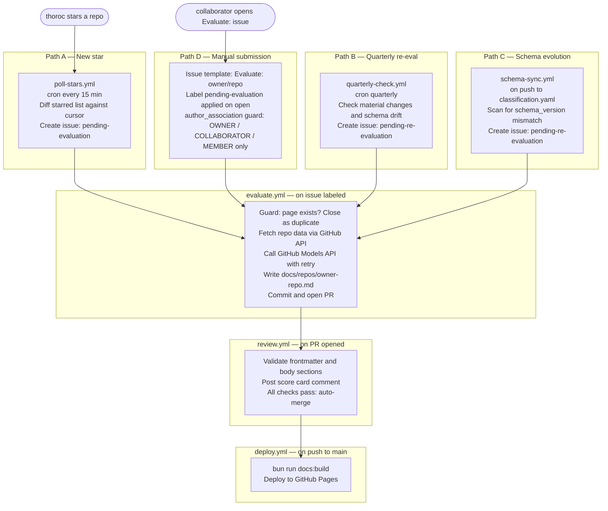
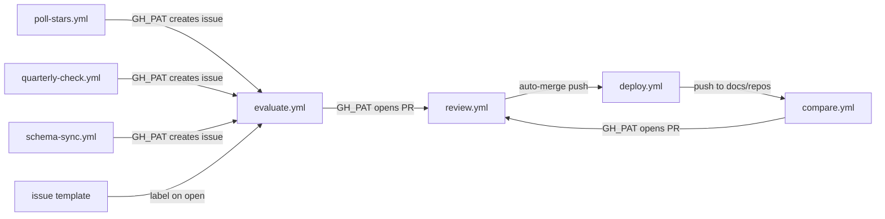

# Architecture

## Overview

Six GitHub Actions workflows form a fully automated pipeline. Stars become issues, issues become PRs, PRs become published pages.

## Component Map

| Component | Location | Role |
|-----------|----------|------|
| `poll-stars.ts` | `scripts/` | Diffs starred list against cursor, deduplicates, creates issues |
| `evaluate.ts` | `scripts/` | Orchestrates data fetch → prompt → LLM call → page write |
| `classification.ts` | `scripts/` | Loads and parses `classification.yaml` |
| `schema.ts` | `scripts/` | Builds Zod schemas dynamically from classification config |
| `generate-schema.ts` | `scripts/` | Emits `docs/schema/repo-page.schema.json` |
| `validate-page.ts` | `scripts/` | Ajv + page-template.yaml checks (called by review.yml) |
| `quarterly-check.ts` | `scripts/` | Scans pages for material changes and schema drift |
| `schema-sync.ts` | `scripts/` | Scans pages for schema_version mismatches, creates issues |
| `classification.yaml` | `docs/schema/` | Single source of truth for dimensions/categories/verdicts |
| `groups.yaml` | `docs/schema/` | Curated comparison group membership |
| `page-template.yaml` | `docs/schema/` | Required body sections for repo pages |
| `compare-template.yaml` | `docs/schema/` | Required body sections for comparison pages |
| `repo-page.schema.json` | `docs/schema/` | Generated JSON Schema for repo frontmatter |
| `compare-page.schema.json` | `docs/schema/` | Generated JSON Schema for comparison frontmatter |
| `last-starred.txt` | `.github/data/` | ISO timestamp cursor for poll-stars |
| `compare.ts` | `scripts/` | Reads groups.yaml + repo pages, builds comparison prompt, writes compare pages |
| `validate-compare.ts` | `scripts/` | Ajv + compare-template.yaml checks (called by compare-review.yml) |

## Cross-Workflow Trigger Chain

`compare.yml` also fires directly on pushes to `docs/schema/groups.yaml`. Ranking pages (`docs/rankings/`) are generated by VitePress data loaders at build time — no workflow involved.

`GITHUB_TOKEN` suppresses downstream workflow triggers; `GH_PAT` is required for all cross-workflow trigger points. See `workflows.md` for the full secrets matrix.
