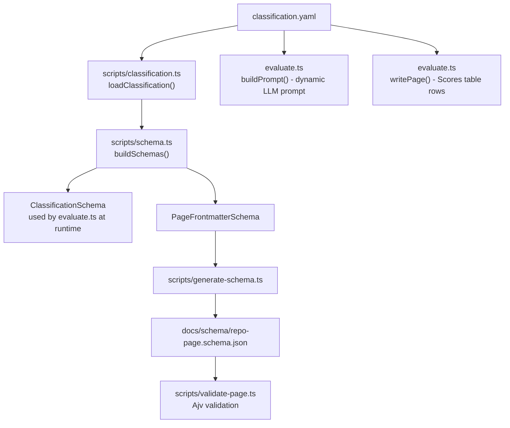

# Classification System

## Overview

The classification system defines the axes used to evaluate starred repos and the controlled tag vocabulary used for discovery. It is designed to evolve: new dimensions, categories, verdicts, or tags can be added at any time without touching TypeScript.

**Source of truth**: `docs/schema/classification.yaml`

All downstream artefacts are derived from this file — Zod schemas, JSON Schema, LLM prompt, page body structure. See ADR-012.

---

## `docs/schema/classification.yaml`

```yaml
version: "1.0.0"

dimensions:
  - id: maturity
    label: Maturity
    description: "How production-ready and battle-tested is the project?"
  - id: maintenance
    label: Maintenance
    description: "How actively is the project maintained and issues addressed?"
  - id: completeness
    label: Completeness
    description: "Does the project deliver on its stated scope?"
  - id: documentation
    label: Documentation
    description: "Quality and coverage of docs, examples, and guides."
  - id: community
    label: Community
    description: "Size, activity, and health of the contributor/user community."

categories:
  - framework
  - library
  - tool
  - template
  - application
  - dataset
  - other

verdicts:
  - id: gem
    description: "Exceptional — a go-to resource, highly recommended"
  - id: solid
    description: "Reliable and well-made, worth using"
  - id: experimental
    description: "Interesting but immature or unstable"
  - id: abandoned
    description: "No longer actively maintained"
  - id: reference-only
    description: "Useful as a reference but not a direct dependency"

tags:
  # Each tag has: id (kebab-case, used in paths), group (display/navigation), description (shown to LLM)
  # Language names are NOT valid tags — language is a dedicated frontmatter field.
  # See ADR-020 for full vocabulary, evolution policy, and rationale.
  - { id: llm-inference,      group: llm,        description: "Libraries/runtimes for running or serving LLMs" }
  - { id: llm-tooling,        group: llm,        description: "Tools that use LLMs to perform a task" }
  - { id: llm-safety,         group: llm,        description: "Guardrails, alignment, censorship controls, or red-teaming" }
  - { id: llm-evaluation,     group: llm,        description: "Benchmarking, scoring, or comparing LLM outputs" }
  - { id: prompt-engineering, group: llm,        description: "Prompt construction, templating, or chaining" }
  - { id: agent-framework,    group: agent,      description: "Frameworks for building autonomous or semi-autonomous agents" }
  - { id: agent-tooling,      group: agent,      description: "Tools that extend, manage, or distribute agent capabilities" }
  - { id: mcp,                group: agent,      description: "Implements or integrates the Model Context Protocol" }
  - { id: mcp-server,         group: agent,      description: "Provides an MCP server (tool/resource provider)" }
  - { id: claude,             group: agent,      description: "Targets or extends the Claude/Anthropic API" }
  - { id: claude-code,        group: agent,      description: "Extension, plugin, or skill set for Claude Code specifically" }
  - { id: openai,             group: agent,      description: "Targets or extends the OpenAI API" }
  - { id: code-generation,    group: code,       description: "Generates source code, scaffolds, or boilerplate" }
  - { id: code-search,        group: code,       description: "Searches or indexes codebases semantically or syntactically" }
  - { id: code-analysis,      group: code,       description: "Static analysis, linting, or type checking" }
  - { id: code-review,        group: code,       description: "Automated code review or PR feedback" }
  - { id: refactoring,        group: code,       description: "Automated or assisted code transformation" }
  - { id: cli,                group: devex,      description: "Primarily a command-line interface tool" }
  - { id: developer-tooling,  group: devex,      description: "General-purpose tooling that improves developer workflow" }
  - { id: testing,            group: devex,      description: "Test runners, assertion libraries, or test utilities" }
  - { id: debugging,          group: devex,      description: "Debugging, tracing, or profiling tools" }
  - { id: observability,      group: devex,      description: "Logging, metrics, distributed tracing" }
  - { id: documentation,      group: devex,      description: "Documentation generation or management" }
  - { id: data-extraction,    group: data,       description: "Scraping, parsing, or extracting structured data" }
  - { id: data-pipeline,      group: data,       description: "ETL, streaming, or batch data processing" }
  - { id: database,           group: data,       description: "Database clients, ORMs, or query builders" }
  - { id: deployment,         group: infra,      description: "Deployment automation or release management" }
  - { id: containerisation,   group: infra,      description: "Docker, Kubernetes, or container orchestration" }
  - { id: ci-cd,              group: infra,      description: "Continuous integration or delivery pipelines" }
  - { id: infrastructure-as-code, group: infra,  description: "Terraform, CDK, Pulumi, or similar IaC tools" }
  - { id: learning,           group: learning,   description: "Curriculum, tutorials, or structured learning material" }
  - { id: reference,          group: learning,   description: "Specifications, guides, or reference documentation" }
  - { id: vscode,             group: ecosystem,  description: "VS Code extension or tight VS Code integration" }
  - { id: github,             group: ecosystem,  description: "GitHub API integration or GitHub-native tooling" }
  - { id: github-actions,     group: ecosystem,  description: "GitHub Actions workflow or custom action" }
  - { id: nx,                 group: ecosystem,  description: "Nx monorepo plugin or integration" }
  - { id: bun,                group: ecosystem,  description: "Bun runtime library or tight Bun integration" }

# Controlled vocabulary for enterprise licensing classification (LLM-assigned, one value)
# See ADR-023
enterprise_use_verdicts:
  - id: free
    description: >
      Permissive license (MIT, Apache-2.0, BSD-*) — safe for commercial and enterprise
      use at no cost. No conditions imposed on consumers beyond attribution.
  - id: restricted
    description: >
      Copyleft license (GPL-2.0, GPL-3.0, AGPL-3.0, LGPL) — usable but viral.
      Distribution or network use of a derivative may require open-sourcing it.
  - id: commercial
    description: >
      Source-available but commercially restricted (BSL-1.1, SSPL-1.0, Commons Clause,
      or an explicit non-commercial clause) — not freely usable in enterprise SaaS or
      commercial products without a paid licence.
  - id: unclear
    description: >
      No license file, a custom or unrecognised license, or genuinely ambiguous terms.
      Treat as all-rights-reserved until legal counsel verifies.

# Controlled vocabulary for liability risk signals (LLM-assigned, 0–N per repo)
# See ADR-023
risk_flags:
  - id: no-license
    description: >
      No license file present. Copyright defaults to all-rights-reserved; using this
      project in any product is legally unsafe without explicit permission from the author.
  - id: license-changed
    description: >
      The project has a documented history of switching from a permissive to a more
      restrictive license (e.g. Terraform → BSL, Redis → SSPL, Elasticsearch → SSPL).
  - id: copyleft-viral
    description: >
      GPL or AGPL license. Linking or deploying a modified version may require
      open-sourcing the consuming codebase under the same terms.
  - id: sspl-bsl
    description: >
      SSPL or BSL licence — explicitly restricts use in competing commercial services.
      OSI does not recognise either as an open-source licence.
  - id: single-maintainer
    description: >
      A single active maintainer with no clear succession plan or governance structure.
      Bus-factor of one.
  - id: no-recent-activity
    description: >
      No commits, releases, or issue responses detectable in the past 12 months.
  - id: known-cve
    description: >
      Has publicly disclosed CVEs or documented security vulnerabilities that are
      unpatched or patched only in versions incompatible with common usage.
  - id: vendor-capture
    description: >
      Controlled by a commercial vendor whose interests may diverge from the open-source
      community — evidenced by CLA requirements, proprietary extensions, or fork restrictions.
  - id: deep-lock-in
    description: >
      Adopting this project creates hard-to-reverse coupling to a specific vendor,
      proprietary protocol, or hosted service.
```

---

## Derivation Chain



---

## Schema Versioning

The `version` field in `classification.yaml` must be bumped on **every** change — additive or breaking. No attempt is made to migrate existing frontmatter values; version mismatch always triggers a full re-evaluation.

Each evaluated page records `schema_version` in its frontmatter. Two mechanisms detect and queue stale pages:

| Mechanism | Trigger | Coverage |
|-----------|---------|----------|
| `schema-sync.yml` | Push to `main` touching `classification.yaml` | Immediate, comprehensive |
| `quarterly-check.ts` | Quarterly cron | Safety net for missed pages |

---

## When to bump `version`

| Change type | Bump required? | Re-evaluation triggered? |
|-------------|---------------|--------------------------|
| Add / remove / rename a `dimension` | Yes | Yes — all pages re-evaluated |
| Change dimension `description` | Yes | Yes |
| Add a new `category` or `verdict` | **No** | No — run `bun run generate:schema` and commit only |
| Change a `category` or `verdict` string/description | No | No |
| **Add a tag or tag group** | **No** | No — run `bun run generate:schema` and commit only |
| **Change a tag `description` or `group`** | No | No — commit only |
| **Rename or remove a tag `id`** | **Yes** | Yes — add `replaced_by`/`deprecated` field, then bump |
| **Add an `enterprise_use_verdict` or `risk_flag`** | **No** | No — run `bun run generate:schema` and commit only |
| **Change a verdict/flag `description`** | No | No — commit only |
| **Rename or remove a verdict/flag `id`** | **Yes** | Yes — bump version; schema-sync queues re-evals |

> Bumping `version` is the signal to `schema-sync.yml` and `quarterly-check.ts` to queue re-evaluations. Keep this signal meaningful — do not bump for additive or display-only changes.

---

## Adding a New Category or Verdict

1. Add entry to `categories` or `verdicts` in `classification.yaml`
2. Do **not** bump `version`
3. Run `bun run generate:schema` — updates `docs/schema/repo-page.schema.json`
4. Commit `classification.yaml` + `repo-page.schema.json` together
5. No re-evaluation issues are created; existing pages remain valid

---

## Adding a New Dimension

1. Add entry to `dimensions` in `classification.yaml`
2. Bump `version` (e.g. `"1.0.0"` → `"1.1.0"`)
3. Run `bun run generate:schema` — updates `docs/schema/repo-page.schema.json`
4. Commit `classification.yaml` + `repo-page.schema.json` together in one commit
5. Push to `main`:
   - `schema-sync.yml` fires automatically
   - Creates `pending-re-evaluation` issues for every existing page
   - `evaluate.yml` re-runs each page using the new prompt (which now includes the new dimension)

---

## Adding a New Tag

1. Add entry to `tags` in `classification.yaml` with `id`, `group`, and `description`
2. Do **not** bump `version`
3. Run `bun run generate:schema` — updates JSON Schema to include the new valid tag value
4. Commit `classification.yaml` + `repo-page.schema.json` together
5. New evaluations will use the tag immediately; existing pages remain valid (they just won't use the new tag until re-evaluated)

---

## Adding a New Tag Group

1. Add entries to `tags` in `classification.yaml` with the new `group` value
2. Do **not** bump `version`
3. Run `bun run generate:schema` and commit
4. A new `docs/tags/groups/<group>.md` data loader page is available at next `docs:build`

---

## Renaming a Tag

1. Add `replaced_by: new-id` to the old tag entry; add the new tag entry
2. Bump `version` — triggers re-evaluation of all pages (existing pages have the old tag value)
3. Run `bun run generate:schema` and commit both files
4. The tag data loader renders the old tag page with a redirect notice during the re-evaluation window
5. After all pages re-evaluated, remove the old tag entry in a follow-up commit (no version bump needed at that point)

---

## Adding a New Enterprise Use Verdict or Risk Flag

1. Add entry to `enterprise_use_verdicts` or `risk_flags` in `classification.yaml`
2. Do **not** bump `version`
3. Run `bun run generate:schema` — updates `docs/schema/repo-page.schema.json`
4. Commit `classification.yaml` + `repo-page.schema.json` together
5. New evaluations will use the new value immediately; existing pages remain valid

## Renaming or Removing an Enterprise Use Verdict or Risk Flag

1. For verdicts: add `replaced_by: new-id` to the old entry; add the new entry
2. For flags: add `deprecated: true` to the entry
3. Bump `version` — triggers re-evaluation of all pages
4. Run `bun run generate:schema` and commit both files
5. Remove deprecated entries after all pages re-evaluated

---

## Score Rubric

All dimensions use the same 1–5 integer scale:

| Score | Meaning |
|-------|---------|
| 1 | Poor |
| 2 | Below average |
| 3 | Average |
| 4 | Good |
| 5 | Excellent |

The model is instructed to return both an integer score and a rationale string per dimension. Integers are stored in frontmatter; rationales are written to the page body Scores table.

---

## Open Questions

- ~~Should `categories` be extensible without a re-evaluation?~~ — **Resolved**: Category additions are non-breaking (existing pages remain valid under the expanded enum). However, the current design uses a single `schema_version` for the whole file; bumping it for a category addition triggers unnecessary mass re-evaluation. **Decision**: bump `schema_version` only when `dimensions` change. Additive-only changes to `categories` or `verdicts` still require running `bun run generate:schema` and committing the updated JSON Schema, but do **not** require a version bump or re-evaluation. Document this distinction in the "Adding" guides below.

- ~~Should verdicts carry a numeric weight?~~ — **Resolved**: No. Verdicts are not ordered by score; they are qualitative labels. If the Phase 3 site needs a default sort order, add a `sort_order` integer to each verdict entry at that point. Omit from v1.0.0.

- ~~Should dimension weights be configurable?~~ — **Resolved**: No. Per-dimension integer scores are sufficient for display and manual comparison. A weighted aggregate score would add implementation complexity for unclear benefit on a personal curation tool. Revisit only if the Phase 3 UI reveals a concrete need.
