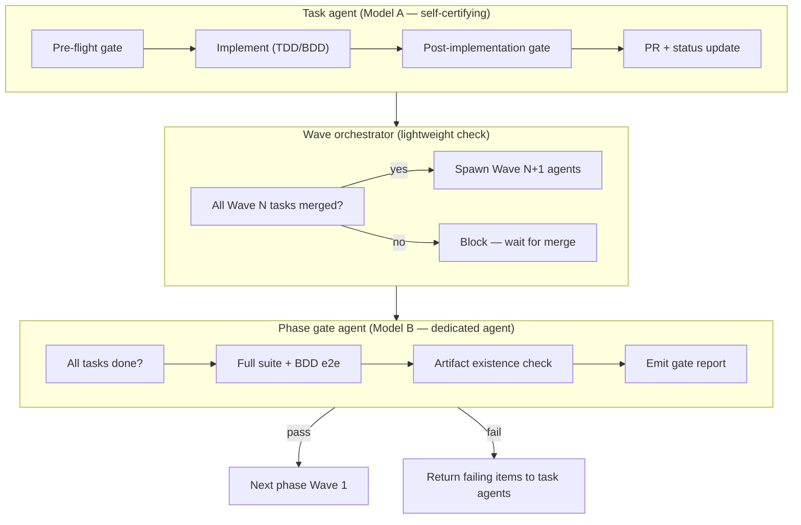

# Implementation flow

Every unit of work passes through a three-level gate model before the next unit
can begin. The model is lightweight for tasks, progressively more rigorous at the
wave and phase boundaries.



---

## Level 1 — Task agent (Model A)

Each task agent self-certifies. It must not push until every gate item passes.
If any item fails the agent stops, reports the failure, and does not proceed.

### Pre-flight gate

Before writing any code:

- [ ] Current branch is `main`, worktree is clean
- [ ] Task file is fully read (not skimmed)
- [ ] Every task listed in `## Depends on` has `Status: done` in its task file
- [ ] Every dependency branch is confirmed merged to `main` via `git log --oneline
  origin/main | grep <task-id>`

### Implementation protocol

Follow the order mandated by the task file:

1. **BDD tasks** — write the Gherkin feature file and step stubs first; run
   Cucumber (expect failing scenarios); then implement until green.
2. **TDD tasks** — write the collocated test file first; run tests (expect red);
   then implement until green.
3. Create branch `feat/<task-id>-<short-description>` before writing any source.

### Post-implementation gate

Before committing:

- [ ] All `## Acceptance Criteria` checkboxes in the task file are ticked
- [ ] `bun run test` passes (or the equivalent verification command from the task
  file)
- [ ] `bun run typecheck` passes (TypeScript projects)
- [ ] `bun run lint` passes
- [ ] `bun run build` passes (if the task touches a build artefact)
- [ ] No unrelated files are staged

### PR and status update

Atomically in the same squash-merge commit:

1. Commit with a conventional message referencing the task ID.
2. Push and open PR — title must include the task ID (e.g. `feat(P01T04): …`).
3. Squash-merge and delete branch immediately (per project convention).
4. Update the task file `## Status` field: `pending → in-progress → done`.
5. Update the phase README `Status` column for that task ID to `done`.

### Failure protocol

If any pre-flight or post-implementation gate item fails:

- Stop immediately — do not push partial work.
- Output a structured failure report:

  ```
  ## Gate failure — <task-id>
  Gate: <pre-flight | post-implementation>
  Failed item: <exact checklist item>
  Detail: <what was observed>
  Blocker: <what needs to happen before this task can proceed>
  ```

- Do not retry in a loop. Surface the blocker to the orchestrator.

---

## Level 2 — Wave orchestrator (lightweight)

The orchestrator is not a separate agent. It is the controlling prompt that spawns
task agents. Between waves it runs a single synchronous check before spawning the
next batch.

### Wave gate (before spawning Wave N+1)

- [ ] Every Wave N task file shows `Status: done`
- [ ] Every Wave N branch is confirmed merged to `main` (`git branch -r` shows no
  open `feat/<wave-n-task-id>` branches)
- [ ] `bun run test` passes on `main` (sanity check after merge)

If any check fails: identify the blocked task, surface it, do not spawn Wave N+1.

---

## Level 3 — Phase gate agent (Model B)

A dedicated agent is spawned after all waves in a phase are complete, before the
next phase begins. Its sole job is to certify that the phase is done and the next
phase can safely start.

### What the phase gate agent checks

**Completeness**

- [ ] Every task in the phase README table shows `Status: done`
- [ ] No open branches named `feat/<phase-task-id>-*` exist on the remote

**Quality**

- [ ] `bun run test` passes on `main` (full suite)
- [ ] `bun run build` passes on `main`
- [ ] The BDD e2e feature file for the phase passes in full (`bun run test:e2e
  --spec <phase-feature-file>`)

**Artefact existence**

For any task in the phase that creates an artefact required by the next phase
(e.g. a config file, a published package, a deployed endpoint), verify the
artefact exists. This is still a Phase N completion check — not a Phase N+1
readiness check.

### Gate report (always emitted)

The phase gate agent always emits a structured report regardless of outcome:

```
## Phase gate report — Phase <N>
Status: PASS | FAIL
Date: <ISO-8601>

### Checks
| Check | Result | Detail |
|-------|--------|--------|
| All tasks done | ✅ / ❌ | <detail if failed> |
| No open branches | ✅ / ❌ | <detail if failed> |
| Full test suite | ✅ / ❌ | <detail if failed> |
| Build passes | ✅ / ❌ | <detail if failed> |
| BDD e2e scenarios | ✅ / ❌ | <detail if failed> |
| Required artefacts | ✅ / ❌ | <detail if failed> |

### Verdict
<PASS: Phase N is complete. Phase N+1 may begin.>
<FAIL: The following items must be resolved before Phase N+1 starts: …>
```

### On PASS

Update the phase README `## Status` field to `done` and proceed to Phase N+1
Wave 1.

### On FAIL

Return the failing items to the relevant task agents with the full gate report.
Do not begin Phase N+1 under any circumstances.

---

## Summary table

| Level | Model | Owner | Key gate condition | Failure action |
|-------|-------|-------|--------------------|----------------|
| Task | A — self-cert | Task agent | ACs ticked + tests + typecheck + lint + build | Stop, emit failure report |
| Wave | A — orchestrator | Controlling prompt | All Wave N tasks `done` + branches merged + tests green | Block, surface blocked task |
| Phase | B — dedicated agent | Gate agent | All tasks `done` + BDD e2e + full suite + artefacts exist | Return failures to task agents, block Phase N+1 |

---

## Reference

- `knowledge-base/task-waves.md` — wave mechanics and parallelisation
- `AGENTS.md` — `## Picking up a task` and `## Parallelising tasks` sections
- Phase READMEs — task tables and BDD feature file references
