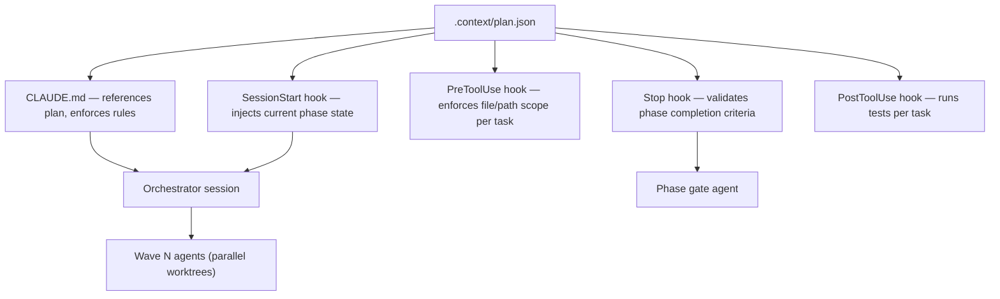

# plan.json

`plan.json` is the machine-readable source of truth for the entire implementation
plan. It is the single file that hooks, orchestrators, and gate agents read to
understand the current state of the project.

**Location:** `.context/plan.json`

---

## Role in the infrastructure



`plan.json` is read-only for task agents. Only two actors may write to it:

1. **Task agents** — update `tasks[].status` (`pending → in-progress → done`).
2. **Phase gate agent** — updates `phases[].status` (`pending → in-progress → done`).

---

## Top-level structure

```json
{
  "$schema": "./plan-schema.json",
  "version": "1.0.0",
  "phases": [ <Phase[]> ]
}
```

| Field | Type | Description |
|-------|------|-------------|
| `$schema` | string | Pointer to the JSON Schema file (future validation) |
| `version` | string | SemVer of the plan format — bump minor for new fields, major for breaking changes |
| `phases` | Phase[] | Ordered list of phases; earlier index = earlier in execution order |

---

## Phase object

```json
{
  "id": "P01",
  "name": "Foundation",
  "goal": "...",
  "exit_criteria": "...",
  "depends_on": ["P00"],
  "status": "pending",
  "bdd_tag": "@phase1",
  "gate_commands": ["bun test", "bunx cucumber-js …"],
  "tasks": [ <Task[]> ]
}
```

| Field | Type | Description |
|-------|------|-------------|
| `id` | string | Short identifier — `P01`, `P02`, … Used as a dependency reference |
| `name` | string | Human-readable phase name |
| `goal` | string | One-sentence goal statement |
| `exit_criteria` | string | Prose description of what "done" means for this phase |
| `depends_on` | string[] | Phase IDs that must be `done` before this phase can start; `[]` for greenfield |
| `status` | `"pending" \| "in-progress" \| "done"` | Phase-level status; updated by phase gate agent |
| `bdd_tag` | string \| null | Cucumber tag used by the phase gate agent to run e2e scenarios; `null` if no BDD gate |
| `gate_commands` | string[] | Ordered list of shell commands the phase gate agent runs to certify completion |
| `tasks` | Task[] | All tasks in this phase, sorted in wave order |

---

## Task object

```json
{
  "id": "P01T04",
  "title": "scripts/classification.ts (TDD)",
  "file": ".context/plans/phase-1-foundation/tasks/task-P01T04-classification-ts.md",
  "wave": 3,
  "depends": ["P01T03"],
  "status": "pending",
  "note": "optional free-text annotation"
}
```

| Field | Type | Description |
|-------|------|-------------|
| `id` | string | Task identifier — `P<phase>T<seq>` format |
| `title` | string | Short description matching the phase README table |
| `file` | string | Repo-root-relative path to the full task spec file |
| `wave` | number \| null | Parallel execution group; `null` means task is superseded or not on the critical path |
| `depends` | string[] | Task IDs (same phase) that must be `done` before this task can start |
| `status` | `"pending" \| "in-progress" \| "done"` | Task-level status; updated by the task agent |
| `note` | string? | Optional annotation (e.g. explaining a `null` wave) |

---

## Status lifecycle

```mermaid
stateDiagram-v2
    [*] --> pending
    pending --> in-progress : agent picks up task
    in-progress --> done : post-implementation gate passes + PR merged
    pending --> done : task superseded (rare)
```

Both the task file (`## Status` field) and `plan.json` (`tasks[].status`) must be
updated atomically in the same squash-merge commit that closes the work.

---

## How hooks consume plan.json

| Hook | What it reads | How it uses it |
|------|---------------|----------------|
| `SessionStart` | `phases[].status`, `tasks[].status` | Injects a summary of the active phase and the current wave into the session context |
| `PreToolUse` | `tasks[].file` | Reads the task file to extract `## Files` — blocks writes outside the declared scope |
| `PostToolUse` | `tasks[].file` | Reads the task file to extract `## Verification` — runs the commands after each write |
| `Stop` | `phases[].gate_commands`, `phases[].bdd_tag` | Runs gate commands before the orchestrator session ends; blocks if any command fails |

> **Important:** `plan.json` stores only structural and status data. Per-task
> `allowed_paths` and `verification_commands` live in the task file (referenced by
> `tasks[].file`). Hooks read the task file at runtime — do not duplicate this data
> into `plan.json`.

---

## Updating plan.json

### When a task is picked up

```json
{ "status": "in-progress" }
```

### When a task is complete

```json
{ "status": "done" }
```

Update in the same commit as the task file `## Status` change. These two fields
must never be out of sync.

### When a phase is certified by the gate agent

```json
{ "status": "done" }
```

The gate agent sets this only after emitting a `PASS` gate report (see
`knowledge-base/implementation-flow.md`).

### Adding a new task

1. Add the task object to the correct `phases[].tasks` array.
2. Set `wave` by applying the wave-determination rules in
   `knowledge-base/task-waves.md`.
3. Add a corresponding task file at the path specified in `file`.
4. Update the phase README table.

All three must be updated together — `plan.json`, task file, and phase README.

---

## Reference

- `knowledge-base/implementation-flow.md` — three-level gate model (task / wave / phase)
- `knowledge-base/task-waves.md` — wave mechanics and parallelisation rules
- Phase READMEs — human-readable task tables (mirrors `plan.json` task arrays)
