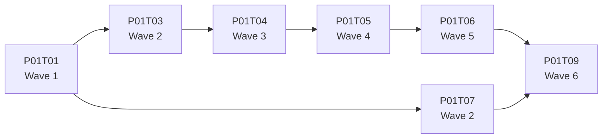

# Task waves

All implementation tasks in each phase are organised into **waves**. Tasks in the
same wave have no dependencies on each other and can be implemented concurrently in
isolated git worktrees. Tasks in wave N+1 cannot start until every task in wave N is
merged to `main`.

---

## How waves are determined

A task's wave is derived from its longest dependency chain:

1. Tasks with no dependencies → **Wave 1**.
2. A task whose only dependencies are Wave 1 tasks → **Wave 2**.
3. A task whose deepest dependency is Wave N → **Wave N+1**.

Ties go into the same wave. The wave number is the critical-path depth, not an
arbitrary sequencing.



---

## Reading the phase README tables

Every phase README contains a `## Tasks` table with these columns:

| Column | Meaning |
|--------|---------|
| **ID** | Task identifier — links to the task file |
| **Task** | Short description |
| **Depends** | Task IDs (linked) that must be merged to `main` before this one can start; `—` means no dependencies |
| **Wave** | Parallel execution group; `—` means the task is superseded or not on the critical path |
| **Status** | `pending` → `in-progress` → `done` |

Tasks are sorted in wave order within the table so the execution sequence reads
top-to-bottom.

---

## Running a wave in parallel

Use Claude Code's `Agent` tool with `isolation: "worktree"` so each agent gets its
own branch and file system copy. Agents in the same wave cannot conflict because they
operate on different files.

```text
Agent(isolation: "worktree", prompt: "Implement P01T02 per its task file …")
Agent(isolation: "worktree", prompt: "Implement P01T03 per its task file …")
Agent(isolation: "worktree", prompt: "Implement P01T07 per its task file …")
Agent(isolation: "worktree", prompt: "Implement P01T08 per its task file …")
```

> **Rule:** Never start a Wave N+1 agent until all Wave N PRs are merged to `main`.

Each agent should:

1. Read its task file and only the documents listed in `## Context` — nothing else
   from `.context/`.
2. Verify that every task listed in `## Depends on` is already merged.
3. Create a branch named `feat/<task-id>-<short-description>`.
4. Implement the task following the TDD or BDD-first approach specified.
5. Run the verification commands from the task file.
6. Commit, push, open a PR.
7. Update the task file `## Status` to `done` and the phase README table `Status`
   column to `done`.

---

## Dependency rules

| Rule | Detail |
|------|--------|
| Intra-phase | A task may only depend on tasks within the same phase or on the previous phase being complete. |
| Cross-phase | Each phase README declares a phase-level `**Depends on:**` prerequisite (e.g. "Phase 1 complete"). Individual tasks in Wave 1 inherit this without repeating it. |
| Superseded tasks | Tasks marked `Status: Superseded` carry a `Wave: —` and are excluded from parallelisation. They document retired approaches; do not implement them. |

---

## Updating status as you work

Two places must be kept in sync:

1. **Task file** — the `## Status` field at the bottom of the file:

   ```
   pending → in-progress → done
   ```

2. **Phase README** — the `Status` column in the `## Tasks` table for that task ID.

Update both atomically in the same commit that closes the implementation work.

---

## When a wave is partially blocked

If one task in a wave is blocked (e.g. waiting on an external credential or a design
decision), the remaining tasks in the same wave can still proceed — they have no
dependency on the blocked task. Only wave N+1 tasks that list the blocked task in
their `## Depends on` section must wait.

---

## Reference

- `AGENTS.md` — `## Picking up a task` and `## Parallelising tasks` sections
- Phase READMEs — wave tables for each phase:
  - `.context/plans/phase-1-foundation/README.md`
  - `.context/plans/phase-2-full-pipeline/README.md`
  - `.context/plans/phase-3-polish-and-comparison/README.md`
  - `.context/plans/phase-4-site-ux-and-navigation/README.md`
