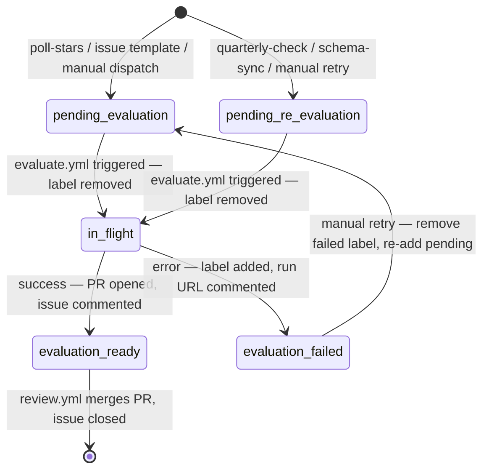

# `evaluate.yml` — Classify repo and open PR

```yaml
on:
  issues:
    types: [labeled]

concurrency:
  group: evaluate-${{ github.event.issue.number }}
  cancel-in-progress: false   # queue, don't cancel — same repo mustn't race itself

permissions:
  contents: write        # create branch, commit
  pull-requests: write   # open PR
  issues: write          # comment, re-label
```

> **Why per-issue group?** Different repos evaluate in parallel (no artificial serialisation). The same issue cannot trigger two concurrent evaluations (e.g. rapid label/unlabel). `cancel-in-progress: false` queues the second run rather than killing the first mid-LLM-call.

**Job condition** (must be first):
```yaml
if: >
  (github.event.label.name == 'pending-evaluation' ||
   github.event.label.name == 'pending-re-evaluation') &&
  (github.event.issue.author_association == 'OWNER' ||
   github.event.issue.author_association == 'COLLABORATOR' ||
   github.event.issue.author_association == 'MEMBER')
```

> **Why author_association guard?** Issues submitted via the issue template auto-receive `pending-evaluation` on open, making the pipeline fully self-service for collaborators. The guard silently no-ops for external submitters — a maintainer can manually re-label any legitimate external issue to unblock it. See ADR-021.

**Issue label lifecycle**:



To retry: remove `evaluation-failed`, add `pending-evaluation` (or `pending-re-evaluation`). The `concurrency` group ensures no duplicate run fires while the issue is already in flight.

**Steps**:
1. `bun install --frozen-lockfile`
2. `bun run lint` — Biome (TS/JS/JSON)
3. `bun run lint:md` — markdownlint-cli2
4. `bun run check:yaml` — parse-check all `.yaml`/`.yml`
5. `bun scripts/evaluate.ts`
   - **Idempotency guard** (skipped for `pending-re-evaluation`): check if `docs/repos/<owner>-<repo>.md` already exists on `main` (`GET /repos/.../contents/...`). If so, close the issue as a duplicate (comment: "page already exists at `docs/repos/<owner>-<repo>.md`"), label `duplicate`, and exit 0. This is the second line of defence against duplicate issues surviving the dedup search. When the triggering label is `pending-re-evaluation`, this guard is **skipped** — the page is expected to already exist and will be overwritten. See ADR-013.
   - Load `docs/schema/classification.yaml`
   - Parse `owner/repo` from issue title (`Evaluate:` / `Re-evaluate:` prefix)
   - Pre-fetch repo data (description, README, languages, latest release) — see ADR-007; README is truncated to the last newline at or before 15,000 chars
   - Build prompt dynamically from classification config
   - Call GitHub Models API (`gpt-4o-mini`) with up to 3 retries
   - **Reality Check**: Compare LLM scores against repo metadata (e.g., if Maturity is 5/5 but repo has 0 releases and was created < 30 days ago, flag with a `hallucination-risk` label instead of auto-merging).
   - Validate response with Zod `ClassificationSchema`
   - Create branch: `eval/<owner>-<repo>` or `re-eval/<owner>-<repo>-<GITHUB_RUN_ID>`
   - Write `docs/repos/<owner>-<repo>.md` (frontmatter + body with rationale table); record `model_id` constant in frontmatter alongside `schema_version`
   - Commit + open PR via `GH_PAT`
   - Comment on issue with PR link; re-label issue `evaluation-ready`
   - **On any unhandled error**: remove triggering label, add `evaluation-failed`, comment with error summary + run URL
