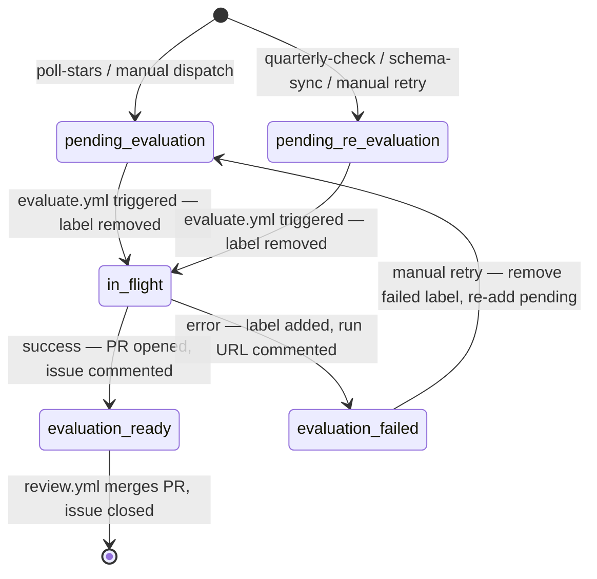

# GitHub Actions Workflows

All workflows use explicit `permissions:` blocks. `GITHUB_TOKEN` is used for read-only operations and LLM API calls; `GH_PAT` is used wherever downstream workflow triggers are required.

## Secrets Matrix

| Secret | Scope | Used by |
|--------|-------|---------|
| `GITHUB_TOKEN` | Auto-injected | GitHub Models API calls; read-only GitHub API calls |
| `GH_PAT` | `public_repo` + `workflow` on `thoroc` | Creating issues, branches, PRs — all cross-workflow trigger points |

> **Why GH_PAT?** When `GITHUB_TOKEN` creates an issue or PR, GitHub suppresses downstream `issues` / `pull_request` workflow triggers to prevent infinite loops. `GH_PAT` bypasses this and allows the chain: `poll-stars → evaluate → review → deploy`.

> **Why `public_repo` + `workflow` only?** All target repos are public and `odyssey` itself is public. `repo` (full private-repo control) is unnecessary and widens blast radius on PAT compromise. `workflow` is required to trigger workflow dispatch events via the API.

---

## `poll-stars.yml` — Detect new starred repos

```yaml
on:
  schedule:
    - cron: '*/15 * * * *'
  workflow_dispatch:

concurrency:
  group: poll-stars
  cancel-in-progress: false   # queue, don't cancel — two concurrent polls would both miss each other's new issues

permissions:
  contents: write   # commit cursor file
  issues: write     # create pending-evaluation issues
```

> **Why serialise poll-stars?** GitHub Issues search index has a propagation lag of several seconds. Two concurrent runs both searching before the first create is indexed will both pass the dedup check and both create the same issue. Serialising eliminates this race at the source.

**Steps**:
1. `bun install --frozen-lockfile`
2. `bun run lint`
3. `bun scripts/poll-stars.ts`
   - Read cursor from `.github/data/last-starred.txt`
   - `GET /users/thoroc/starred?sort=created&direction=desc&per_page=50`
   - For each repo starred after cursor: search for open issue `Evaluate: owner/repo` — skip if found
   - Create issue via `GH_PAT`: title `Evaluate: owner/repo`, label `pending-evaluation`, body:
     ```
     **Starred**: <starred_at ISO date>
     **Description**: <repo description, or *(none)*>
     **Language**: <primary language, or *(unknown)*>
     **Stars**: <stargazers_count>
     **URL**: https://github.com/<owner>/<repo>
     ```
   - **Commit cursor last**: advance `last-starred.txt` only after all issues in this batch are created; if the commit fails, the next run re-fetches the same window and dedup skips already-open issues — no duplicates, no data loss, cursor self-heals on next successful run

---

## `evaluate.yml` — Classify repo and open PR

```yaml
on:
  issues:
    types: [labeled]

concurrency:
  group: evaluate-${{ github.event.issue.number }}
  cancel-in-progress: false   # queue, don't cancel — same repo mustn't race itself

permissions:
  contents: write        # create branch, commit
  pull-requests: write   # open PR
  issues: write          # comment, re-label
```

> **Why per-issue group?** Different repos evaluate in parallel (no artificial serialisation). The same issue cannot trigger two concurrent evaluations (e.g. rapid label/unlabel). `cancel-in-progress: false` queues the second run rather than killing the first mid-LLM-call.

**Job condition** (must be first):
```yaml
if: >
  github.event.label.name == 'pending-evaluation' ||
  github.event.label.name == 'pending-re-evaluation'
```

**Issue label lifecycle**:



To retry: remove `evaluation-failed`, add `pending-evaluation` (or `pending-re-evaluation`). The `concurrency` group ensures no duplicate run fires while the issue is already in flight.

**Steps**:
1. `bun install --frozen-lockfile`
2. `bun run lint`
3. `bun scripts/evaluate.ts`
   - **Idempotency guard** (skipped for `pending-re-evaluation`): check if `docs/repos/<owner>-<repo>.md` already exists on `main` (`GET /repos/.../contents/...`). If so, close the issue as a duplicate (comment: "page already exists at `docs/repos/<owner>-<repo>.md`"), label `duplicate`, and exit 0. This is the second line of defence against duplicate issues surviving the dedup search. When the triggering label is `pending-re-evaluation`, this guard is **skipped** — the page is expected to already exist and will be overwritten. See ADR-013.
   - Load `docs/schema/classification.yaml`
   - Parse `owner/repo` from issue title (`Evaluate:` / `Re-evaluate:` prefix)
   - Pre-fetch repo data (description, README, languages, latest release) — see ADR-007; README is truncated to the last newline at or before 4,000 chars (never mid-sentence/mid-word)
   - Build prompt dynamically from classification config
   - Call GitHub Models API (`gpt-4o-mini`) with up to 3 retries
   - Validate response with Zod `ClassificationSchema`
   - Create branch: `eval/<owner>-<repo>` or `re-eval/<owner>-<repo>-<GITHUB_RUN_ID>`
   - Write `docs/repos/<owner>-<repo>.md` (frontmatter + body with rationale table); record `model_id` constant in frontmatter alongside `schema_version`
   - Commit + open PR via `GH_PAT`
   - Comment on issue with PR link; re-label issue `evaluation-ready`
   - **On any unhandled error**: remove triggering label, add `evaluation-failed`, comment with error summary + run URL

---

## `review.yml` — Validate and auto-merge

```yaml
on:
  pull_request:
    types: [opened, synchronize]
    branches: [main]

permissions:
  contents: write        # merge
  pull-requests: write   # post review comment, approve
```

Runs only on `eval/*`, `re-eval/*`, and `compare/*` branches.

**Steps**:
1. `bun install --frozen-lockfile`
2. `bun run lint`
3. `bun run check:schema` — regenerates JSON schemas in a temp directory and diffs against committed `docs/schema/repo-page.schema.json` and `docs/schema/compare-page.schema.json`; exits non-zero if stale. Runs unconditionally on all branches. See ADR-017.
4. Dispatch on branch prefix:
   - `eval/*` / `re-eval/*` → `bun scripts/validate-page.ts <changed-file>`
     - Validate frontmatter against `repo-page.schema.json` (Ajv)
     - Validate body sections against `page-template.yaml`
     - Verify file path matches `docs/repos/<owner>-<repo>.md`
   - `compare/*` → `bun scripts/validate-compare.ts <changed-file>`
     - Validate frontmatter against `compare-page.schema.json` (Ajv)
     - Validate body sections against `compare-template.yaml`
     - Verify file path matches `docs/compare/<group-slug>.md`
5. Post PR review comment with formatted summary
6. All checks pass → `gh pr merge --auto --squash`
7. **On validation failure**: post review comment with Ajv error details; exit non-zero (fails the required status check; PR stays open for inspection; no auto-merge)

> **Auto-merge trust boundary**: `review.yml` validates structural correctness (schema + body sections) only — it does not assert semantic quality. A hallucinated 5/5 across all dimensions will pass and auto-merge. This is intentional: `odyssey` is a personal curation tool; the human act of starring is the quality signal. The LLM provides structured scores and rationales for browsing, not a gating judgement. If you want human review before merge, remove `gh pr merge --auto` and approve PRs manually.

> **Prerequisite**: Branch protection on `main` must list this workflow's check as required. Set in Settings → Branches → Branch protection rules.

---

## `deploy.yml` — Build and publish GitHub Pages

```yaml
on:
  push:
    branches: [main]
    paths:
      - 'docs/**'

concurrency:
  group: pages
  cancel-in-progress: true   # only the latest push to main wins; earlier queued deploys are discarded

permissions:
  contents: read
  pages: write
  id-token: write
```

> **Why `cancel-in-progress: true`?** Multiple PRs merging in quick succession each trigger `deploy.yml`. Only the final state matters — cancelling stale deploys prevents a race where an older build overwrites a newer one on GitHub Pages.

**Steps**:
1. `bun install --frozen-lockfile`
2. `bun run docs:build` (`vitepress build docs`)
3. `actions/upload-pages-artifact` with `docs/.vitepress/dist`
4. `actions/deploy-pages`

---

## `quarterly-check.yml` — Detect material changes

```yaml
on:
  schedule:
    - cron: '0 9 1 1,4,7,10 *'   # 1st Jan, Apr, Jul, Oct 09:00 UTC
  workflow_dispatch:

permissions:
  issues: write
```

**Steps**:
1. `bun install --frozen-lockfile`
2. `bun scripts/quarterly-check.ts`
   - Load current `classification.yaml` version
   - Read all `docs/repos/*.md` frontmatter (synchronous, no API call)
   - Use `p-limit(5)` to cap concurrent GitHub API calls at 5; prevents secondary rate-limit errors on large corpora
   - For each page (up to 5 in parallel):
     - `GET /repos/<owner>/<repo>` — fetch `archived`, `pushed_at`, `stargazers_count`, latest release
     - Run material-change heuristics (see table below)
     - If triggered: dedup check, then create issue via `GH_PAT` with title `Re-evaluate: owner/repo`, label `pending-re-evaluation`, body:
       ```
       **Trigger**: <signal description, e.g. "Major version bump: v3.2.1 → v4.0.0">
       **Evaluated schema_version**: <schema_version from frontmatter>
       **Current classification.yaml version**: <current version>
       **Stars at eval**: <stars_at_eval> → **Current stars**: <stargazers_count>
       **URL**: https://github.com/<owner>/<repo>
       ```
   - Issues are created with `p-limit(5)` (same cap used for API reads)

**Material-change heuristics**:

| Signal | Threshold |
|--------|-----------|
| Major version bump | Latest tag major > `version_at_eval` major (skip if `version_at_eval` is null) |
| Archived | `archived: true` |
| Long dormancy | No commits in 12 months AND maintenance score was ≥ 3 |
| Revival | Commits resumed after 6+ months of silence |
| Stars surge | `stargazers_count` grew > 50% since `stars_at_eval` |
| Schema drift | `schema_version` != current `classification.yaml` version |

---

## `schema-sync.yml` — Re-evaluate on classification change

```yaml
on:
  push:
    branches: [main]
    paths:
      - 'docs/schema/classification.yaml'
  workflow_dispatch:

permissions:
  issues: write
```

**Steps**:
1. `bun install --frozen-lockfile`
2. `bun run check:schema` — fail fast if committed JSON schemas are stale (see ADR-017); prevents creating re-evaluation issues with a mismatched schema.
3. `bun scripts/schema-sync.ts`
   - Read current `version` from `classification.yaml`
   - For each `docs/repos/*.md`: read `schema_version` from frontmatter
   - Use `p-limit(5)` for issue creation: for each stale page, run dedup search then create `pending-re-evaluation` issue via `GH_PAT` (see ADR-019), body:
     ```
     **Trigger**: Schema version mismatch
     **Page schema_version**: <schema_version from frontmatter>
     **Current classification.yaml version**: <current version>
     **URL**: https://github.com/<owner>/<repo>
     ```

Designed to be idempotent: a second push without a version bump produces no new issues (dedup suppresses them).

---

## `compare.yml` — Generate comparison pages

```yaml
on:
  push:
    branches: [main]
    paths:
      - 'docs/repos/**'
      - 'docs/schema/groups.yaml'
  workflow_dispatch:
    inputs:
      group_id:
        description: 'Specific group to regenerate (leave empty for all affected groups)'
        required: false

concurrency:
  group: compare
  cancel-in-progress: false   # queue regenerations; don't discard in-flight LLM calls

permissions:
  contents: write
  pull-requests: write
```

**Steps**:
1. `bun install --frozen-lockfile`
2. `bun scripts/compare.ts`
   - Read `docs/schema/groups.yaml`
   - Determine affected groups: from changed `docs/repos/` files (cross-reference group membership) or `dispatch` input; if `groups.yaml` changed, all groups are affected
   - **No-op fast exit**: if no groups are affected (changed repo is not a member of any group), exit 0 immediately — no API calls, no LLM calls. See ADR-016.
   - Skip any group with fewer than 2 repos that have evaluated pages
   - Use `p-limit(3)` to process up to 3 affected groups concurrently; each group:
     - Read all member repo pages from `docs/repos/` — extract frontmatter + body
     - Build comparison prompt: inject scores, summaries, tags, and verdicts for all members
     - Call GitHub Models API with up to 3 retries
     - Validate response structure in-process (compare-page schema + compare-template)
     - Write `docs/compare/<group-slug>.md` (frontmatter + Summary table + Recommendation + Comparison sections)
     - Commit to branch `compare/<group-slug>`, open PR via `GH_PAT`
   - **On error for a group**: log error details; continue with remaining groups. See ADR-016.

> **Cascade behaviour**: during a mass re-evaluation wave (e.g. schema-sync), `compare.yml` queues one run per merged eval PR. Runs where the changed repo belongs to no group are no-ops (< 1 s). Only runs where the repo is a group member incur LLM calls — capped at 3 concurrent groups per run, serialised across runs by the `concurrency: group: compare` block. See ADR-016.

> **Ranking pages are not generated here.** `docs/rankings/index.md` and `docs/rankings/<group>.md` are built by VitePress data loaders at `docs:build` time — always current, no committed file needed.
