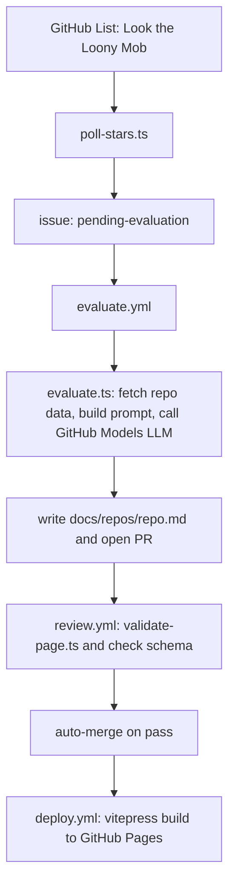

# Odyssey — Agent Guide

## Commands

All commands use `bun` — Node.js is not required.

```bash
bun install                     # Install dependencies (uses bun.lockb)
bun test                        # Run unit tests (collocated *.test.ts files)
bunx cucumber-js --config cucumber.json  # Run BDD e2e scenarios
bunx cucumber-js --tags "not @slow"      # Skip long-running pipeline scenarios
bun run lint                    # biome ci .
bun run check                   # biome check --write .
bun run format                  # biome format --write .
bun run generate:schema         # Emit docs/schema/repo-page.schema.json
bun run check:schema            # Fail if committed JSON schema is stale
bun run validate:page           # Validate a repo page against schema + page-template.yaml
bun run docs:dev                # VitePress dev server
bun run docs:build              # Build VitePress site → docs/.vitepress/dist
```

Dry-run all scripts locally (suppresses all writes, safe against real GitHub state):

```bash
bun scripts/evaluate.ts --dry-run
bun scripts/poll-stars.ts --dry-run
bun scripts/quarterly-check.ts --dry-run
bun scripts/schema-sync.ts --dry-run
bun scripts/compare.ts --dry-run
```

## Architecture

Odyssey is a fully-automated GitHub Actions pipeline that classifies repos from a
curated GitHub List and publishes a VitePress site to GitHub Pages. No server;
everything is scripts + workflows + static files.

### Pipeline flow



Comparison pages (`docs/rankings/`) are generated at build time by VitePress data
loaders — never committed.

### Key source locations

| Component | Path | Role |
|-----------|------|------|
| `poll-stars.ts` | `scripts/` | Fetches GitHub List via GraphQL, creates `pending-evaluation` issues |
| `evaluate.ts` | `scripts/` | LLM orchestration: fetch → prompt → call → write page |
| `classification.ts` | `scripts/` | Parses `classification.yaml` |
| `schema.ts` | `scripts/` | Builds Zod schemas dynamically from classification config |
| `generate-schema.ts` | `scripts/` | Emits `docs/schema/repo-page.schema.json` |
| `validate-page.ts` | `scripts/` | Ajv + page-template.yaml checks |
| `quarterly-check.ts` | `scripts/` | Scans pages for material changes / schema drift |
| `schema-sync.ts` | `scripts/` | Creates re-evaluation issues for schema_version mismatches |
| `compare.ts` | `scripts/` | Builds comparison pages from `groups.yaml` |
| `classification.yaml` | `docs/schema/` | **Single source of truth** for dimensions, categories, verdicts, schema_version |
| `groups.yaml` | `docs/schema/` | Comparison group membership |
| `page-template.yaml` | `docs/schema/` | Required body sections for repo pages |

### Schema versioning

`classification.yaml` carries a `version` field. Every `docs/repos/*.md` frontmatter
includes `schema_version`. When they diverge, `schema-sync.ts` creates a
`pending-re-evaluation` issue. The committed `repo-page.schema.json` is generated from
`classification.yaml` — run `bun run check:schema` to verify they're in sync (enforced
in CI).

### Secrets

`GITHUB_TOKEN` cannot trigger downstream workflows. Use `GH_PAT` (Personal Access
Token) for all cross-workflow trigger points. See `.context/workflows.md` for the full
secrets matrix.

### Concurrency limits

- GitHub API calls in `quarterly-check.ts` and issue creation in `schema-sync.ts`: `p-limit(5)`
- LLM calls in `compare.ts`: `p-limit(3)`

## Testing strategy

Three levels — see `.context/adr/018-testing-strategy.md` for full rationale.

1. **TDD unit tests** (`bun test`) — pure functions only; no GitHub API mocks. Tests
   are **collocated** alongside source (`scripts/classification.test.ts`, not
   `__tests__/`). Write the test file **before** the implementation (red → green →
   refactor).

2. **`--dry-run` flag** — all scripts accept `--dry-run`; reads execute, writes are
   skipped and logged. Use for local iteration against real GitHub state.

3. **BDD e2e** (CucumberJS) — feature files in `features/`, step definitions in
   `features/step-definitions/`. Write the `.feature` file before implementing the
   pipeline stage. Long-running scenarios tagged `@slow`.

## Conventions

- Always create feature branches — never commit directly to `main`.
- Conventional commit messages (`feat:`, `fix:`, `docs:`, etc.).
- All diagrams must be Mermaid — never ASCII art.
- `.context/` files shard at 300 lines.

## Key context documents

| Document | Purpose |
|----------|---------|
| `.context/architecture.md` | Component map and data flow |
| `.context/toolchain.md` | Full tool choices with rationale |
| `.context/workflows.md` | All GitHub Actions workflows with steps and secrets |
| `.context/classification.md` | Classification schema design |
| `.context/adr/` | All architectural decision records |
