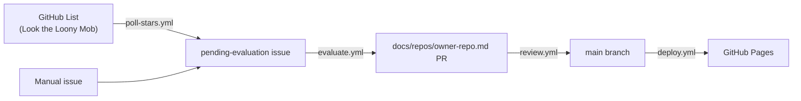

# Odyssey

Automated pipeline that classifies repositories from a curated GitHub List and publishes a
[VitePress](https://vitepress.dev) site to GitHub Pages. No server — everything is scripts,
GitHub Actions workflows, and static files.

## What it does

1. **Ingests** repos from the GitHub List _Look the Loony Mob_ (poll every 15 min) or via a
   manual issue submission.
2. **Evaluates** each repo using the GitHub Models API against a versioned classification
   schema (`classification.yaml`).
3. **Publishes** a structured Markdown page per repo under `docs/repos/`, reviewed and
   auto-merged before deploying to GitHub Pages.
4. **Re-evaluates** quarterly or whenever the classification schema version changes.

## Status

**Planning and documentation phase.** No source code or workflows have been implemented yet.

See [`AGENTS.md`](./AGENTS.md) for architecture, commands, testing strategy, and context
documents. Start at [`.context/plans/implementation-plan.md`](./.context/plans/implementation-plan.md).

## Contributing / agents

This repo is designed for both human contributors and AI agents. Read `AGENTS.md` before
making changes.

- Branch from `main` — never commit directly.
- Conventional commit messages (`feat:`, `fix:`, `docs:`, `chore:`).
- All diagrams must be Mermaid — no ASCII art.
